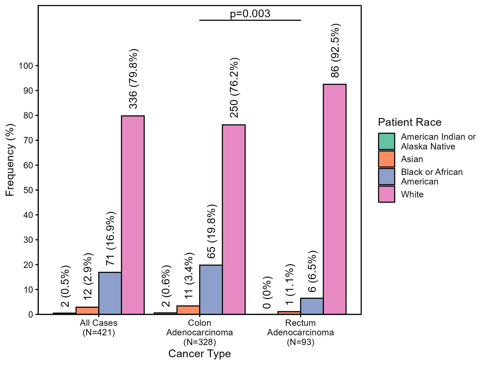
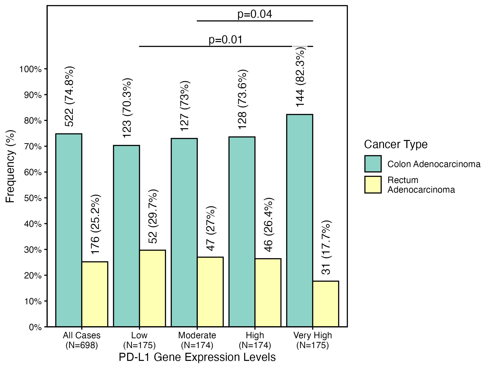
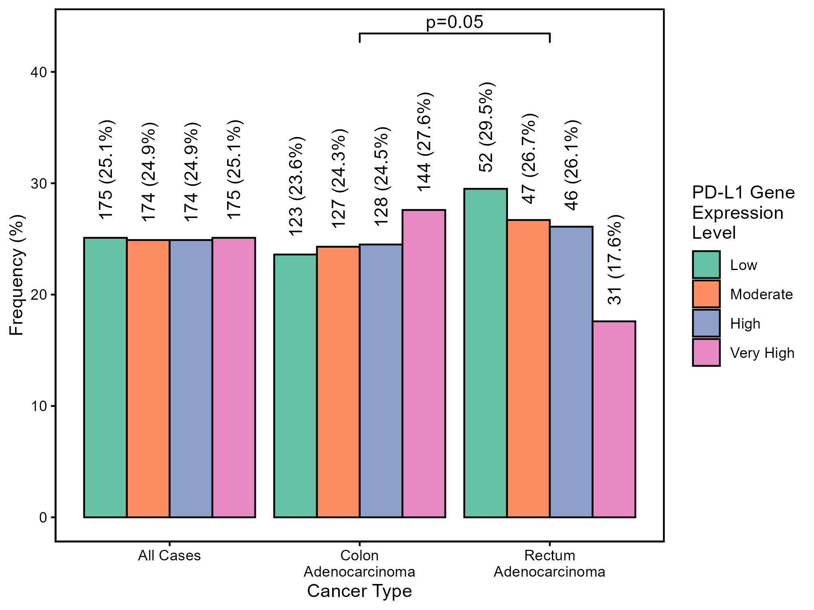
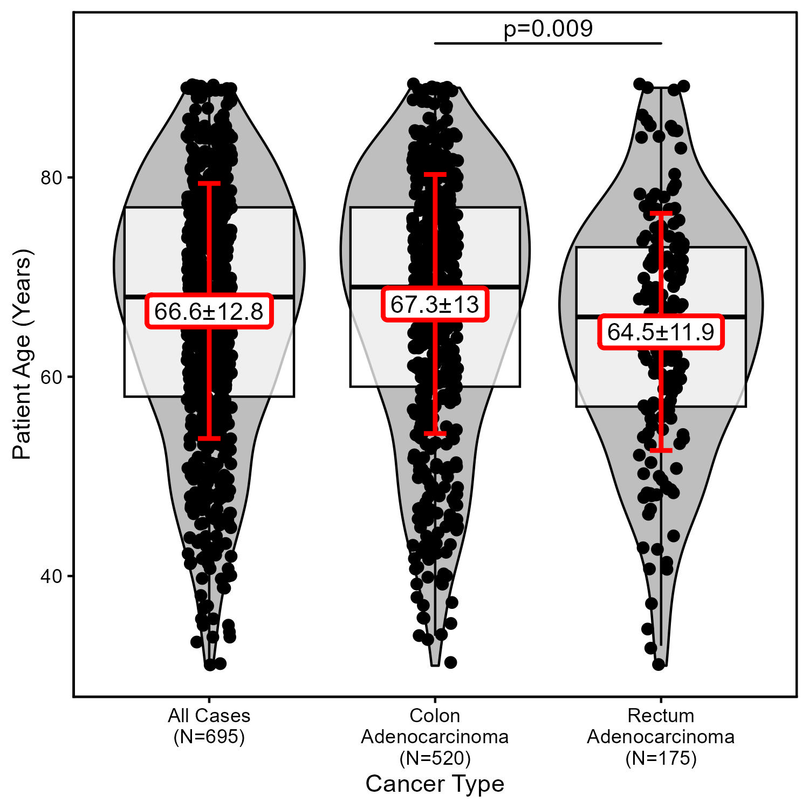
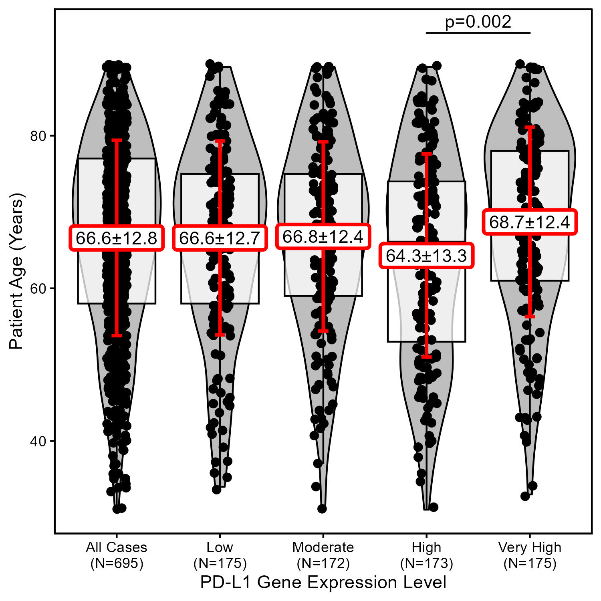
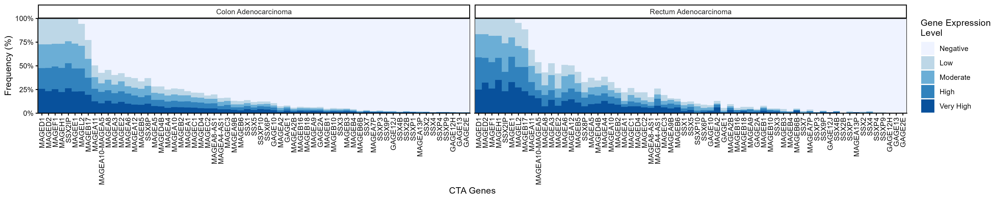
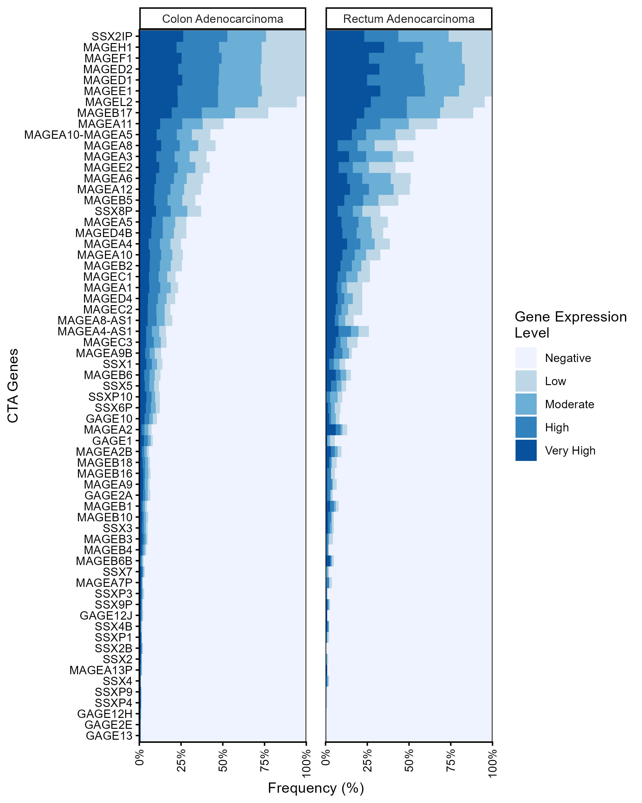
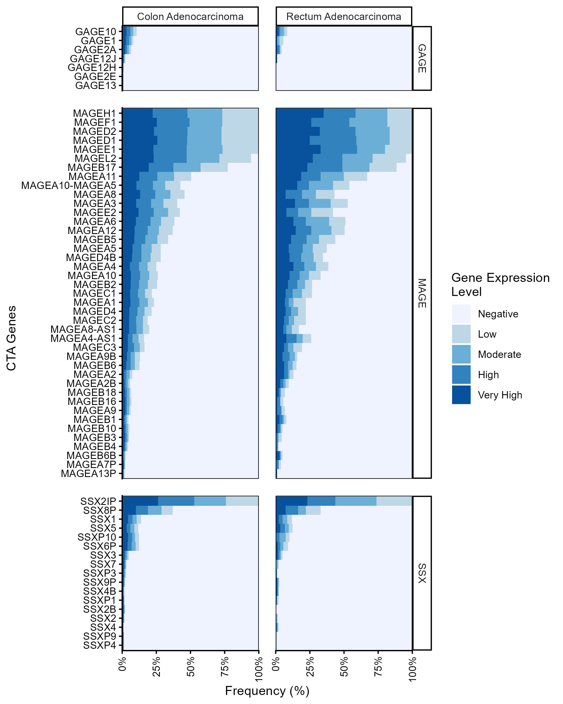
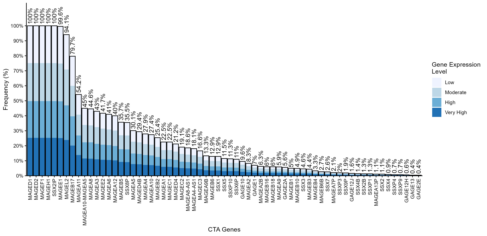
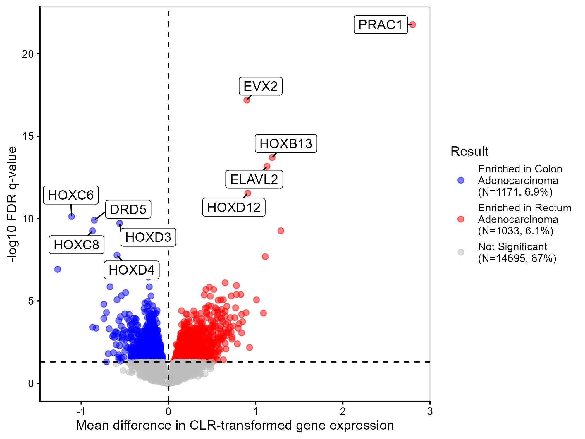

# Introduction {#sec-introduction}

This document showcases usage examples for `RCodeBox` functions using a real oncology dataset. See the following sections for example data preparation and usage examples. This is a living document that will be updated as new functions and additional functionality of existing functions are added.

Lets go ahead and load the `RCodeBox` package and other packages will need for this vignette.

```{r}
#| label: load-packages

# Main package
library(RCodeBox)

# Packages for prepping the example data
library(TCGAbiolinks)
library(SummarizedExperiment)

# Packages for general data wrangling, plotting, display
library(dplyr)
library(tidyr)
library(RColorBrewer)
library(DT)
```

# Example Data Prep {#sec-data-prep}

The below section details how to download and prep the example dataset used to showcase `RCodeBox` function usage. 

::: {.callout-note}

The example data download and preparation process can be lengthy, so feel free to skip to the [Usage Examples](#sec-usage-examples) section and pickup with the prepped data that's stored in and is automatically loaded from the package itself.

:::

First we download some example transcriptomic and corresponding clinical data from [The Cancer Genome Atlas (TCGA) data portal](https://portal.gdc.cancer.gov/) via the `TCGAbiolinks` package to use in our examples. We will obtain primary tumor and solid normal tissue data from colon adenocarcinoma (COAD) and rectum adenocarcinoma (READ) cases from TCGA.

First specify the query parameters for the TCGA data.

```{r}
#| label: query
#| eval: false

query = GDCquery(
  project = c("TCGA-COAD", "TCGA-READ"),
  data.category = "Transcriptome Profiling",
  data.type = "Gene Expression Quantification",
  sample.type = c("Primary Tumor", "Solid Tissue Normal")
)
```

Then we can download the data using the query specifications.

```{r}
#| label: data-download
#| eval: false

GDCdownload(query)
```

We then use the `GDCprepare` function to prepare the downloaded data by concatenating all the individual RNA-seq files we just downloaded and attaching corresponding clinical data. The prepared data is a `RangedSummarizedExperiment` object, so we will need to use the `SummarizedExperiment` package to work with it. We can extract out the data we need to more standard dataframe formats to simplify further processing. 

```{r}
#| label: prep-data
#| eval: false

# Prepare downloaded data
gdc_data = GDCprepare(query, save = FALSE)

# Extract different data modalities into data.frames
clinical_data = data.frame(colData(gdc_data))
gex_data = data.frame(rowData(gdc_data))
gex_counts = data.frame(assay(gdc_data, "unstranded"))
gex_tpm = data.frame(assay(gdc_data, "tpm_unstrand"))

# Remove any temp files if they were created
if (file.exists("df.rds")) {
  file.remove("df.rds")
}
if (file.exists("results.rds")) {
  file.remove("results.rds")
}
```

As stated above, the prepared data from this section is contained within the `RCodeBox` package and can be readily accessed as soon as you load the package into R.

# Usage Examples {#sec-usage-examples}

The following sections show `RCodeBox` functions in action based on some typical use cases. These are not meant to cover *everything* you can do with the functions in `RCodeBox`, just give an idea of how they are used.

Lets load the prepared TCGA data.

```{r}
#| label: load-data

data(clinical_data)
data(gex_data)
data(gex_counts)
data(gex_tpm)
```

## Stratified Statistics Table {#sec-stratified-stat-table}

The function `stratified_stat_table` is a good workhorse function for quickly creating a publication-ready table of summary statistics with statistical testing for multiple categorical and quantitative variables. The function's main input is a dataframe with a grouping variable of interest and other variables you are interested in calculating summary statistics for and determining if any significantly differ between groups in the grouping variable. You can either display the variable names as they are, or supply a named list to rename the variables (i.e., if you want more formatted labeling in the table). You can additionally supply covariates to adjust for during statistical testing. The function uses Firth's penalized logistic regression (via the `logistf` package) or linear regression (via the base `lm` function) to test categorical and quantitative variables, respectively. 

### Two Group Table {#sec-stratified-stat-table-2-group}

Below we use the function on a two group grouping variable: determining what patient demographics and/or clinical variables may differ between the cancer histologies, i.e., colon and rectal adenocarcinoma. We can visualize this as an HTML-based table with the function `kable_html_table`, which is useful for when you are performing analyses in interactive notebooks like Quarto or Rmarkdown and rendering to HTML.

See @tbl-1 for results.

```{r}
#| label: tbl-1
#| tbl-cap: "Patient and clinical characteristics in colon and rectal adenocarcinoma cases"

# Define grouping variable
groups = "name"

# Define columns of interest
columns = c(
  "age_at_index",
  "gender",
  "race",
  "ethnicity",
  "ajcc_pathologic_stage",
  "prior_treatment",
  "sample_type"
)

# Define named list to rename variables by
rename_dict = list(
  "Age",
  "Gender",
  "Race",
  "Ethnicity",
  "Clinical Stage",
  "Prior Treatment",
  "Tissue Sample Type"
)
names(rename_dict) = columns

# Create data for testing
test_data = clinical_data[, c("barcode", groups, columns)]

# Set not reported or unknown data to missing
for (col in columns) {
  if (is.character(test_data[[col]]) | is.factor(test_data[[col]])) {
    test_data[[col]][grepl(
      "not reported|unknown",
      test_data[[col]],
      ignore.case = TRUE
    )] = NA
  }
}

# Simplify staging information
test_data[["ajcc_pathologic_stage"]] = factor(
  dplyr::case_when(
    grepl("Stage IV", test_data[["ajcc_pathologic_stage"]]) ~ "Stage IV",
    grepl("Stage III", test_data[["ajcc_pathologic_stage"]]) ~ "Stage III",
    grepl("Stage II", test_data[["ajcc_pathologic_stage"]]) ~ "Stage II",
    grepl("Stage I", test_data[["ajcc_pathologic_stage"]]) ~ "Stage I",
    .default = NA
  )
)

# Build and display table
results = stratified_stat_table(test_data, groups, columns, rename_dict)
kable_html_table(results, bold_columns = c(1, 2))
```

We can see from the results that patients with rectal adenocarcinoma in this dataset were significantly younger than patients with colon adenocarcinoma by 2.8 years on average (P=0.01) and were more likely to be White (92.5%, P=3E-4) compared to colon adenocarcinoma, which had a significantly lower frequency of White patients (76.2%) and higher frequency of Black or African American patients (19.8% vs 6.5%, P=1E-3). These would be important confounding variables to consider in further analyses assessing differences between these two groups.

Using the `export_to_xlsx` function, we can export the results to a publication-ready table. 

::: {.callout-tip}

Make sure to specify the `numeric_columns` parameter if there are any numeric columns in the data, so it is formatted correctly or else it will come out as text (which is not the end of the world, just annoying).

:::

```{r}
#| label: export-tbl-1

export_to_xlsx(
  results,
  out_path = "example_output/table1.xlsx",
  sheet = "Table 1",
  numeric_columns = "P"
)
```

This is a snapshot of the exported table in Excel.


### Multi Group Table {#sec-stratified-stat-table-multi}

Below we use the function on a grouping variable with more than two groups: determining what patient demographics and/or clinical variables may differ between different gene expression quartiles of PD-L1 (*CD274*). The overall parameters and process for the `stratified_stat_table` are the same, but the output and interpretation are a little different. Instead of just one coefficient and corresponding p-value per variable as seen for a two group grouping variable, the function will output coefficients and p-values for each group specified in the grouping variable. This is because the function performs statistical testing for each group vs all other groups (one-vs-all testing framework) in lieu of performing an omnibus test for differences across groups (e.g., what's done in a Kruskal-Wallis rank-sum test or ANOVA).

See @tbl-2 for results.

```{r}
#| label: tbl-2
#| tbl-cap: "Patient and clinical characteristics stratified by PD-L1 (CD274) gene expression level"

# Define grouping variable
groups = "pdl1_gex"

# Add cancer type to columns of interest and rename list since we're not
# using it as a grouping variable now
columns = c(columns, "name")
rename_dict["name"] = "Cancer Type"

# Create needed grouping variable
ensgid = gex_data[["gene_id"]][gex_data[["gene_name"]] == "CD274"]
quantiles = quantile(unlist(as.vector(gex_tpm[ensgid, ])))
test_data[[groups]] = factor(
  dplyr::case_when(
    gsub("-", ".", rownames(test_data)) %in%
      colnames(gex_tpm)[gex_tpm[ensgid, ] >= quantiles[4]] ~ "Very High",
    gsub("-", ".", rownames(test_data)) %in%
      colnames(gex_tpm)[gex_tpm[ensgid, ] >= quantiles[3]] ~ "High",
    gsub("-", ".", rownames(test_data)) %in%
      colnames(gex_tpm)[gex_tpm[ensgid, ] >= quantiles[2]] ~ "Moderate",
    gsub("-", ".", rownames(test_data)) %in%
      colnames(gex_tpm)[gex_tpm[ensgid, ] < quantiles[2]] ~ "Low",
    .default = NA
  ),
  levels = c("Low", "Moderate", "High", "Very High")
)

# Build and display table
results = stratified_stat_table(test_data, groups, columns, rename_dict)
kable_html_table(results, bold_columns = c(1, 2))
```

From these results we see that patients with tumors having very high PD-L1 gene expression tended to be older by 2.8 years on average compared to other gene expression levels (P=0.01) and tended to be from predominately White patients (91.2%, P=2E-4). These associations may be partially due to an enrichment of colon adenocarcinoma cases in very high PD-L1 expressing tumors (82.3% vs 70-74% in other groups, P=8E-3), which were associated with these patient demographics in the previous results.

To test and see if these associations with age and race are at least partly due to enrichment of colon adenocarcinoma cases, we can supply cancer type as a covariate to the `stratified_stat_table` function, adjusting the analyses for differences between cancer types. 

::: {.callout-tip}

For a sanity check, we can leave cancer types in the table, the results will just be moot since we are adjusting the analysis by this variable, but it will tell us that we are successfully adjusting for these effects.

:::

See @tbl-adj-2 for results.

```{r}
#| label: tbl-adj-2
#| tbl-cap: "Patient and clinical characteristics stratified by PD-L1 (CD274) gene expression level and adjusting for cancer type"

# Define covariates
covariates = "name"

# Build and display table
results_adj = stratified_stat_table(
  test_data,
  groups,
  columns,
  rename_dict,
  covariates
)
kable_html_table(results_adj, bold_columns = c(1, 2))
```

We see that the age and race associations are still there for patients with very high PD-L1 expressing tumors, so we can conclude these associations are independent of the association seen between PD-L1 gene expression and cancer type (at least in the current dataset). As expected, the results for cancer types are basically null (odds ratio confidence intervals are huge and p-value is ~1), so we know the adjustment was working.

Using the `export_to_xlsx` function, we can export the results to a publication-ready table like we did before.

```{r}
#| label: export-tbl-2

export_to_xlsx(
  results,
  out_path = "example_output/table2.xlsx",
  sheet = "Table 2",
  numeric_columns = "P"
)
```


::: {.callout-caution}

* While the `kable_html_table` and `export_to_xlsx` should be flexible to work with any dataframe, they were specifically designed to work with results from running the `stratified_strat_table` function, therefore, unexpected results may occur when using them not on this function's output.

* Additionally, I would only used `kable_html_table` on smaller tables as it has no pagination capability. If wanting to display larger tables in HTML, I would use the `datatable` function from the `DT` package, or something similar.

* Theoretically, the `stratified_stat_table` function will work with any grouping variable regardless the number of groups contained within the variable, however, that doesn't mean you SHOULD test a ton of groups, especially since the function does not do multiple testing correction. I would limit to 3 or 4 groups, any more than that you really should be doing multiple testing corrections and it will start to become difficult to interpret results. If you have a grouping variable with a lot of groups, see if you can collapse some or break it up somehow to make it more digestible.

:::

## Plotting {#sec-plotting}

A number of functions included in this package can be used for quickly generating publication-ready data visualizations that are commonly performed in scientific research. These functions produce the following types of plots:

[**Traditional Plots**](#sec-traditional-plots)

* [`stratified_barplot`](#sec-stratified-barplot): Plot for showing the frequency distribution of a categorical variable of interest stratified by a grouping variable.

* [`stratified_violin_boxplot`](#sec-stratified-violin-boxplot): Plot for visualizing the distributions of a quantitative variable of interest stratified by a grouping variable.

[**Specialty Plots**](#sec-specialty-plots)

* [`composition_barplot`](#sec-composition-barplot): Stacked barplot normalized to 1 (or 100%) for showing compositions of a categorical variable of interest within groups or individual observations (e.g., a breakdown of genetic ancestry compositions for a cohort of individuals).

* [`longtail_plot`](#sec-longtail-plot): Non-normalized stacked barplots for showing compositions of a categorical variable of interest within groups while preserving (and sorting by) the total count/frequency of groups. Observations are sorted from most prevalent to least, creating a "long tail" of data, hence the name. Commonly used for visualizing genomic alteration frequencies grouped by genes and broken down by alteration type.

* [`volcano_plot`](#sec-volcano-plot): Plot for visualizing the relationship between p-values (y-axis) and effect sizes (x-axis) obtained from statistically testing many features of a single data modality (e.g., testing for differentially expressed genes from RNA-seq experiments).

All functions have the option to save the image to file and modify the width and height of the exported file, so it's publication-ready.

:::{.callout-note}

The units for image width and height are in pixels (e.g., 1000 x 1500 pixels).

:::

:::{.callout-tip}

All functions use the `ggplot2` package and packages that extend it's functionality and return a ggplot2 figure object. This means that you have the ability to add more to the plots, or modify existing layers of the plot within the object if needed. These functions should get you 90% - 100% of the way, but every now and then you may need to tweak things.

:::

### Traditional Plots {#sec-traditional-plots}

The following functions produce plots that are useful for showing the distributions of categorical or quantitative variables stratified by a grouping variable. These plots are traditional distribution plots, used in any field involving statistical analyses.

Additional to the plotting functionality, you can optionally request pairwise statistical testing to be performed (with or without multiple testing correction) and significant associations annotated in the plots. Statistical testing is performed via Fisher's exact test (`fisher.test`) or Chi-squared test (`chisq.test`) for categorical variables (i.e., those handled by `stratified_barplot`) and Welch's t-test (`t.test`) or Wilcoxon rank-sum test (`wilcox.test`) for quantitative variables (i.e., those handled by `stratified_violin_boxplot`).

#### Stratified Bar Plots {#sec-stratified-barplot}

To demonstrate the `stratified_barplot` function, lets visualize the distributions of self-reported race within each of the cancer types we've been looking at. Recall earlier that there were significantly more White patients in the rectal adenocarcinoma group compared to the colon adenocarcinoma group, which was more diverse.

See @fig-1 for the result.

```{r}
#| label: plot-1

g = stratified_barplot(
  test_data,
  groups = "name",
  column = "race",
  xlab = "Cancer Type",
  legendlab = "Patient Race",
  test = "fisher.test",
  alpha = 0.05,
  save = TRUE,
  figwidth = 2000,
  figheight = 1500,
  out_path = "example_output/figure1.jpg"
)
```

{#fig-1}

Indeed we see the enrichment of self-reported White patients in the rectal adenocarcinoma group and that the overall racial distribution between the two groups is significantly different (P=0.003). From statistical testing previously, we know this is due to the enrichment of White patients in the rectal adenocarcinoma group.

:::{.callout-tip}

The text size of plots have been left at the `ggplot2` default since it's difficult to try and calculate the most effective text size on the front end. If text is too small or too large, play around with the `figwidth` and `figheight` parameters to change the size of the exported image, which will influence how well the text fits.

:::

Now lets visualize the relationship between cancer type and different gene expression levels of PD-L1 (another significant association we observed earlier).

See @fig-2 for the result.

```{r}
#| label: plot-2

g = stratified_barplot(
  test_data,
  groups = "pdl1_gex",
  column = "name",
  xlab = "PD-L1 Gene Expression Levels",
  legendlab = "Cancer Type",
  test = "fisher.test",
  alpha = 0.05,
  save = TRUE,
  figwidth = 2000,
  figheight = 1500,
  out_path = "example_output/figure2.jpg"
)
```

{#fig-2}

Again we see tumors with very high PD-L1 gene expression had significantly different distributions of the two cancer types compared to other groups, mainly tumors with low or moderate PD-L1 gene expression. 

Because both variables being visualized by the `stratified_barplot` function are categorical, we can switch out the grouping variable and target variable to pivot the plot and look at the data from the alternate end.

See @fig-3 for the results.

```{r}
#| label: plot-3

g = stratified_barplot(
  test_data,
  groups = "name",
  column = "pdl1_gex",
  xlab = "Cancer Type",
  legendlab = "PD-L1 Gene Expression Level",
  test = "fisher.test",
  alpha = 0.05,
  save = TRUE,
  figwidth = 2000,
  figheight = 1500,
  out_path = "example_output/figure3.jpg"
)
```

{#fig-3}

:::{.callout-caution}

Be wary with how many columns are being plotted when using `stratified_barplot`. Similar to the `stratified_stat_table` function, there is nothing in the code (yet) that hinders you from specifying variables with any number of groups, but I again would caution not to specify a grouping variable with more than 3 or 4 groups. The `longtail_plot` or `composition_barplot` functions handle many groups much more efficiently. See section [Specialty Plots](#sec-specialty-plots) for more on those.

:::

:::{.callout-tip}

If you do not specify a grouping variable to `groups`, then a simple barplot with only all cases will be plotted.

:::

#### Stratified Violin-Boxplots {#sec-stratified-violin-boxplot}

To demonstrate the `stratified_violin_boxplot` function, lets visualize the distributions of patient age within each of the cancer types we've been looking at. Recall earlier that patients with colon adenocarcinoma tended to be a few years younger on average than patients with rectal adenocarcinoma.

See @fig-4 for the result.

```{r}
#| label: plot-4

g = stratified_violin_boxplot(
  test_data,
  groups = "name",
  column = "age_at_index",
  xlab = "Cancer Type",
  ylab = "Patient Age (Years)",
  test = "t.test",
  alpha = 0.05,
  save = TRUE,
  figwidth = 1500,
  figheight = 1500,
  out_path = "example_output/figure4.jpg"
)
```

{#fig-4}

As we did earlier, we see the significant, almost 3 year age difference between patients with colon and rectal adenocarcinoma.

Now lets visualize the distribution of patient age based on the PD-L1 gene expression levels we created. Recall very high PD-L1 gene expression was associated with older patient age on average.

See @fig-5 for the result.

```{r}
#| label: plot-5

g = stratified_violin_boxplot(
  test_data,
  groups = "pdl1_gex",
  column = "age_at_index",
  xlab = "PD-L1 Gene Expression Level",
  ylab = "Patient Age (Years)",
  test = "t.test",
  alpha = 0.05,
  save = TRUE,
  figwidth = 1500,
  figheight = 1500,
  out_path = "example_output/figure5.jpg"
)
```

{#fig-5}

From the distributions and pairwise testing, we see that the key difference lies between patients whose tumors have moderate PD-L1 gene expression compared to the very high expression group.

### Specialty Plots {#sec-specialty-plots}

The following functions produce plots that are more niche in nature, typically used in certain situations commonly come across in biomedical research. Unlike the [Traditional Plots](#sec-traditional-plots), these plots won't include any statistical testing and are just used for visualizing large amounts of data or results from larger analyses.

#### Composition Barplots {#sec-composition-barplot}

Composition barplots are stacked barplots that are normalized to 1 or 100% in order to show how groups or individual observations are composed of another categorical variable of interest. Common use cases for this type of plot include visualizing ancestry admixture in a cohort of individuals, or microbial compositions of biological samples taken from organisms or the environment, but it can be used for any situation where you want to show proportions of a categorical variable within individual observations or groups.

To showcase the `composition_barplot` function, we will visualize the breakdown of gene expression levels for a set of genes known as cancer testis antigen (CTA) genes in the two cancer types we've been working with. CTA genes are a class of genes primarily expressed in normal germ cells of the testis but can get reactivated in various cancers, which make them good potential targets for immunotherapy and cancer vaccines.

Similar to what we did with PD-L1 gene expression, we will first create a number of new variables indicating gene expression levels of different CTA genes, then, for each gene, we will plot the breakdown of gene expression levels in colon and rectal adenocarcinoma cases. This can give us an idea of what CTA genes are most highly expressed in these cohorts. We will target genes in the `MAGE`, `GAGE`, and `SSX` gene families.

:::{.callout-note}

Could we plot the gene expression values for these genes as violin-boxplots? Absolutely, that would be another good option to get a feel for the data. Sometimes though, especially for highly skewed data, it's nice to bin data into discrete categories because it's difficult to see differences between groups with the distributions of numeric values. Because CTA genes are expressed only in normal germ cell tumors and only reactivated somatically by cancer cells, their expression is usually quite sparse and their distributions will be highly skewed toward 0. This would make most violin-boxplots look squished, with a dense bottom around 0 and very spindle-like towards higher values.

:::

See @fig-6 for the results.

```{r}
#| label: plot-6

# Create needed grouping variables
ensgid = gex_data[["gene_id"]][grepl("MAGE|GAGE|SSX", gex_data[["gene_name"]])]
for (id in ensgid) {
  x = unlist(as.vector(gex_tpm[id, ]))
  quantiles = quantile(x[x > 0]) # Getting quantiles on non-zero data due to sparsity
  test_data[[gex_data[id, "gene_name"]]] = factor(
    dplyr::case_when(
      gsub("-", ".", rownames(test_data)) %in%
        colnames(gex_tpm)[gex_tpm[id, ] >= quantiles[4]] ~ "Very High",
      gsub("-", ".", rownames(test_data)) %in%
        colnames(gex_tpm)[gex_tpm[id, ] >= quantiles[3]] ~ "High",
      gsub("-", ".", rownames(test_data)) %in%
        colnames(gex_tpm)[gex_tpm[id, ] >= quantiles[2]] ~ "Moderate",
      gsub("-", ".", rownames(test_data)) %in%
        colnames(gex_tpm)[gex_tpm[id, ] >= quantiles[1]] ~ "Low",
      gsub("-", ".", rownames(test_data)) %in%
        colnames(gex_tpm)[gex_tpm[id, ] < quantiles[1]] ~ "Negative",
      .default = NA
    ),
    levels = c("Negative", "Low", "Moderate", "High", "Very High")
  )
}

# Create a data.frame in "long" format for plotting
long_data = tidyr::pivot_longer(
  test_data[, c(
    "name",
    grep("MAGE|GAGE|SSX", colnames(test_data), value = TRUE)
  )],
  cols = grep("MAGE|GAGE|SSX", colnames(test_data), value = TRUE),
  names_to = "genes",
  values_to = "level"
)

# Perform plotting
g = composition_barplot(
  long_data,
  groups = "genes",
  column = "level",
  subcolumns = "name",
  xlab = "CTA Genes",
  legendlab = "Gene Expression Level",
  color_list = RColorBrewer::brewer.pal(
    length(levels(long_data[["level"]])),
    "Blues"
  ),
  save = TRUE,
  figwidth = 5000,
  figheight = 1000,
  out_path = "example_output/figure6.jpg"
)
```

{#fig-6}

As expected for CTA genes, there is a lot of low-level expression among these cases with only a handful of genes having fairly high expression levels.

The plot looks a little squished in horizontal orientation, so we can use the parameter `flip_plot = TRUE` to make it vertical. See @fig-7.

```{r}
#| label: plot-7

g = composition_barplot(
  long_data,
  groups = "genes",
  column = "level",
  subcolumns = "name",
  xlab = "CTA Genes",
  legendlab = "Gene Expression Level",
  color_list = RColorBrewer::brewer.pal(
    length(levels(long_data[["level"]])),
    "Blues"
  ),
  flip_plot = TRUE,
  save = TRUE,
  figwidth = 2000,
  figheight = 2500,
  out_path = "example_output/figure7.jpg"
)
```

{#fig-7}

Definitely looks better in this orientation.

We can also add another grouping on the bars themselves to break them up into meaningful categories. Lets group the genes we're showing by gene family (i.e., `MAGE`, `GAGE`, `SSX`).

```{r}
#| label: plot-8

# Add variable denoting gene family
long_data[["gene_family"]] = dplyr::case_when(
  grepl("MAGE", long_data[["genes"]]) ~ "MAGE",
  grepl("GAGE", long_data[["genes"]]) ~ "GAGE",
  grepl("SSX", long_data[["genes"]]) ~ "SSX",
  .default = NA
)

# Perform plotting
g = composition_barplot(
  long_data,
  groups = "genes",
  column = "level",
  subrows = "gene_family",
  subcolumns = "name",
  xlab = "CTA Genes",
  legendlab = "Gene Expression Level",
  color_list = RColorBrewer::brewer.pal(
    length(levels(long_data[["level"]])),
    "Blues"
  ),
  flip_plot = TRUE,
  save = TRUE,
  figwidth = 2000,
  figheight = 2500,
  out_path = "example_output/figure8.jpg"
)
```

{#fig-8}

:::{.callout-tip}

Depending on if you choose to flip the orientation of the plot with `flip_plot`, you may need to switch around the variables being specified to `subrows` and/or `subcolumns` to make the groupings work correctly. You can tell that the groupings are not working if you get blank columns in the panels.

:::

#### Longtail Plots {#sec-longtail-plot}

Longtail plots refer to non-normalized stacked barplots for showing compositions of a categorical variable of interest within groups while preserving (and usually sorting by) the total count/frequency of groups. Observations are sorted from most prevalent to least, creating a "long tail" of data, which is where the name comes from. A common use case for this type of plot is visualizing genomic alteration frequencies grouped by genes and broken down by alteration type. For sake of simplicity, we will use the same data as we did above for the composition barplot, except we will not plot the `Negative` values. This is the main difference between a "composition" and "longtail" barplot, not plotting the "negative", null, or missing results, so that the bar doesn't reach 100% all of the time. We will use the `negative_value` parameter in the `longtail_barplot` function to specify what is the negative value to not plot.

See @fig-9 for the results.

```{r}
#| label: plot-9

g = longtail_barplot(
  long_data,
  groups = "genes",
  column = "level",
  negative_value = "Negative",
  xlab = "CTA Genes",
  legendlab = "Gene Expression Level",
  color_list = RColorBrewer::brewer.pal(
    length(levels(long_data[["level"]])) - 1,
    "Blues"
  ),
  save = TRUE,
  figwidth = 3500,
  figheight = 1700,
  out_path = "example_output/figure9.jpg"
)
```

{#fig-9}

As we saw in the composition barplot, a handful of *MAGE* genes and one *SSX* are expressed in at least half of tumors, but most of the CTA genes were sparsely detected.

#### Volcano Plots {#sec-volcano-plot}

Volcano plots (given the name by their volcano-like appearance) are great for visualizing the relationship between p-values (plotted on the y-axis, typically after -log10 transformation) and the corresponding effect sizes (plotted on the x-axis) from statistically testing many features of a single data modality. The original use case for this type of plot was visualizing the results from differential gene expression analyses (derived from micro-array or RNA-seq), where the -log10 p-value and fold change (usually log2 transformed) are plotted together. However, this plot can be used for visualizing any results where many p-values and effect sizes are obtained (e.g., differential abundance analysis for microbiome data or differential protein expression from proteomics). For sake of examples though, we will go with the standard use case and utilize the RNA-seq data we've downloaded -- performing a differential expression analysis between our cancer types and visualizing those results with the `volcano_plot` function.

:::{.callout-important}

While the `volcano_plot` function can be used to visualize any number of p-values and effect sizes, it really is only appropriate to use when the data being tested was derived from the **same** modality of data, i.e., not mixing results from many different data types that are not related. For example, I would use this plot to visualize results from the same RNA-seq or proteomic experiment, but I would not use it to visualize p-values and effect sizes from testing a large number of different clinical variables, each of which can be related or not and have completely different scales and interpretations. There are better plots for those types of analyses if you want to show them side by side (e.g., forest plots).

:::

First lets perform a quick differential expression analysis on the RNA-seq data between the two cancer types. We can use the `stratified_stat_table` function to do this and extract what we need for plotting from the results.

:::{.callout-note}

Because we are analyzing a type of omics data with the `stratified_stat_table` function (i.e., high-throughput data that only contains numeric variables), I will set `omics_mode = TRUE` to modify the workflow as needed when working with omics data, including turning off the automatic formatting of variable names and performing multiple testing correction. If I didn't set this, then all of the gene names would only have the first letter capitalized, which would make them look like mouse/rat gene names. Additionally, all of the gene names would have had "Mean±SD" added to them, which would have just added useless size to the data since all the data is numeric.

:::

See @tbl-3 for results with a false discovery rate (FDR) corrected q-value < 0.05.

```{r}
#| label: tbl-3
#| tbl-cap: "Differential gene expression analysis results for colon vs rectal adenocarcinoma"

# Prepare the gene expression data for analysis by transposing data to be
# sample by gene, filtering genes by those that (1) have non-zero expression in
# at least 50% of cases and (2) are protein coding, transform the data using a
# simple centered log-ratio transformation, and add cancer type variable
gex_test_data = data.frame(t(gex_counts))
gex_test_data = gex_test_data[,
  colSums(gex_test_data > 0) > (0.5 * nrow(gex_test_data)) &
    colnames(gex_test_data) %in%
      gex_data[["gene_id"]][gex_data[["gene_type"]] == "protein_coding"]
]
gex_test_data = data.frame(t(apply(gex_test_data, 1, function(x) {
  log(x + 1) - mean(log(x + 1))
})))
gex_test_data = data.frame(
  gex_test_data,
  name = test_data[gsub("\\.", "-", colnames(gex_counts)), "name"]
)

# Define grouping variable
groups = "name"

# Define columns of interest
columns = colnames(gex_test_data)[-ncol(gex_test_data)]

# Define named list to rename variables by
rename_dict = as.list(gex_data[["gene_name"]])
names(rename_dict) = gex_data[["gene_id"]]

# Run analysis
results = stratified_stat_table(
  gex_test_data,
  groups,
  columns,
  rename_dict,
  omics_mode = TRUE
)

# Display significant results
sig_results = results[as.numeric(results[["FDR"]]) < 0.05, ]
sig_results = sig_results[order(as.numeric(sig_results[["P"]])), ]
DT::datatable(sig_results, rownames = FALSE)
```

Now lets plot the differential expression analysis results using the `volcano_plot` function.

See @fig-10 for the results.

```{r}
#| label: plot-10

g = volcano_plot(
  results,
  variable = "Variable",
  coef = "Coef",
  pvalue = "FDR",
  transform_pvalue = TRUE,
  alpha = 0.05,
  top_n = 5,
  first_group_name = "Colon Adenocarcinoma",
  second_group_name = "Rectum Adenocarcinoma",
  ylab = "-log10 FDR q-value",
  xlab = "Mean difference in CLR-transformed gene expression",
  save = TRUE,
  figwidth = 2000,
  figheight = 1500,
  out_path = "example_output/figure10.jpg"
)
```

{#fig-10}

Just looking at our top 5 hits on either side of the plot, we can see that our results make sense for what we would expect in gene expression differences between colon and rectal adenocarcinoma cancer types:

**Rectal-enriched (positive ΔCLR)**

* *PRAC1* sits ~4 kb downstream of *HOXB13* on 17q21 and is classically described as Prostate, Rectum And distal Colon expressed; both genes tend to be co‑regulated. Seeing them as the top rectal markers is expected.
* *HOXB13* is a posterior HOX gene with high expression in rectum; it is even [used diagnostically as a rectal neuroendocrine tumor marker](https://link.springer.com/article/10.1007/s12022-023-09779-9).
* *EVX2* and *HOXD12* lie at/near the 5′ end of the HOXD cluster (2q31) and often travel with posterior HOXD regulation; seeing both enriched together is a nice internal consistency check.

**Colon‑enriched (negative ΔCLR)**

* *HOXC6*/*HOXC8* (and *HOXD3*/*HOXD4*) are more anterior than *HOXB13*/*HOXD12* in the HOX “code”. Prior work repeatedly reports HOXC family up‑regulation in colon cancer (especially right colon), so finding them higher in “colon vs. rectum” is very plausible.

:::{.callout-important}

If you have previously transformed p-values with a `-log10` or other transformation and are setting `transform_pvalue = FALSE`, make sure that you specify `alpha` using the corresponding transformed value (e.g., `alpha = -log10(0.05)` if you already used a `-log10` transform). If not, the function will not work correctly.

:::

## Utilities {#sec-utilities}

:::{.callout-caution}
## Under Construction

Come back later!

:::

# R Session {#sec-r-session}

```{r}
#| label: r-session
#| echo: false
sessionInfo()
```