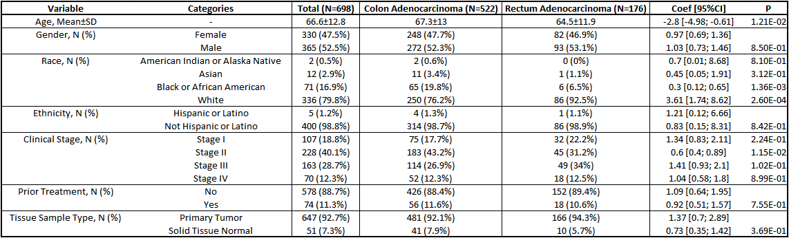
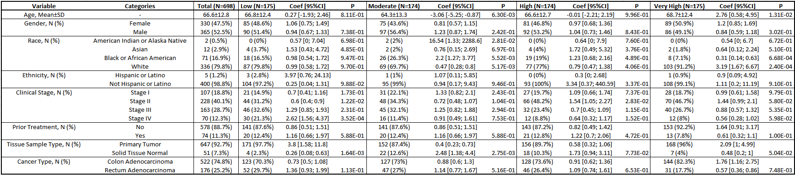

# Introduction {#sec-introduction}

This document showcases usage examples for `RCodeBox` functions using a real oncology dataset. See the following sections for example data preparation and usage examples. This is a living document that will be updated as new functions and additional functionality of existing functions are added.

Lets go ahead and load the `RCodeBox` package and other packages will need for this vignette.

```{r}
#| label: load-packages

library(RCodeBox)
library(TCGAbiolinks)
library(SummarizedExperiment)
```

# Example Data Prep {#sec-data-prep}

The below section details how to download and prep the example dataset used to showcase `RCodeBox` function usage. 

::: {.callout-note}
The example data download and preparation process can be lengthy, so feel free to skip to **@sec-usage-examples** and pickup with the prepped data that's stored in and is automatically loaded from the package itself.
:::

First we download some example transcriptomic and corresponding clinical data from [The Cancer Genome Atlas (TCGA) data portal](https://portal.gdc.cancer.gov/) via the `TCGAbiolinks` package to use in our examples. We will obtain primary tumor and solid normal tissue data from colon adenocarcinoma (COAD) and rectum adenocarcinoma (READ) cases from TCGA.

First specify the query parameters for the TCGA data.

```{r, eval = FALSE}
#| label: query

query = GDCquery(
  project = c("TCGA-COAD", "TCGA-READ"),
  data.category = "Transcriptome Profiling",
  data.type = "Gene Expression Quantification",
  sample.type = c("Primary Tumor", "Solid Tissue Normal")
)
```

Then we can download the data using the query specifications.

```{r, eval = FALSE}
#| label: data-download

GDCdownload(query)
```

We then use the `GDCprepare` function to prepare the downloaded data by concatenating all the individual RNA-seq files we just downloaded and attaching corresponding clinical data. The prepared data is a `RangedSummarizedExperiment` object, so we will need to use the `SummarizedExperiment` package to work with it. We can extract out the data we need to more standard dataframe formats to simplify further processing. 

```{r, eval = FALSE}
#| label: prep-data

# Prepare downloaded data
gdc_data = GDCprepare(query, save = FALSE)

# Extract different data modalities into data.frames
clinical_data = data.frame(colData(gdc_data))
gex_data = data.frame(rowData(gdc_data))
gex_counts = data.frame(assay(gdc_data, "unstranded"))
gex_tpm = data.frame(assay(gdc_data, "tpm_unstrand"))

# Remove any temp files if they were created
if (file.exists("df.rds")) {
  file.remove("df.rds")
}
if (file.exists("results.rds")) {
  file.remove("results.rds")
}
```

As stated above, the prepared data from this section is contained within the `RCodeBox` package and can be readily accessed as soon as you load the package into R.

# Usage Examples {#sec-usage-examples}

The following sections show `RCodeBox` functions in action based on some typical use cases. These are not meant to cover *everything* you can do with the functions in `RCodeBox`, just give an idea of how they are used.

## Stratified Statistics Table

The function `stratified_stat_table` is a good workhorse function for quickly creating a publication-ready table of summary statistics with statistical testing for multiple categorical and quantitative variables. The function's main input is a dataframe with a grouping variable of interest and other variables you are interested in calculating summary statistics for and determining if any significantly differ between groups in the grouping variable. You can either display the variable names as they are, or supply a named list to rename the variables (i.e., if you want more formatted labeling in the table). You can additionally supply covariates to adjust for during statistical testing. The function uses Firth's penalized logistic regression (via the `logistf` package) or linear regression (via the base `lm` function) to test categorical and quantitative variables, respectively. 

### Two Group Table

Below we use the function on a two group grouping variable: determining what patient demographics and/or clinical variables may differ between the cancer histologies, i.e., colon and rectal adenocarcinoma. We can visualize this as an HTML-based table with the function `kable_html_table`, which is useful for when you are performing analyses in interactive notebooks like Quarto or Rmarkdown and rendering to HTML.

See **@tbl-1** for results.

```{r}
#| label: tbl-1
#| tbl-cap: "Patient and clinical characteristics in colon and rectal adenocarcinoma cases"

# Define grouping variable
groups = "name"

# Define columns of interest
columns = c(
  "age_at_index",
  "gender",
  "race",
  "ethnicity",
  "ajcc_pathologic_stage",
  "prior_treatment",
  "sample_type"
)

# Define named list to rename variables by
rename_dict = list(
  "Age",
  "Gender",
  "Race",
  "Ethnicity",
  "Clinical Stage",
  "Prior Treatment",
  "Tissue Sample Type"
)
names(rename_dict) = columns

# Create data for testing
test_data = clinical_data[, c(groups, columns)]

# Set not reported or unknown data to missing
for (col in columns) {
  if (is.character(test_data[[col]]) | is.factor(test_data[[col]])) {
    test_data[[col]][grepl(
      "not reported|unknown",
      test_data[[col]],
      ignore.case = TRUE
    )] = NA
  }
}

# Simplify staging information
test_data[["ajcc_pathologic_stage"]] = factor(
  dplyr::case_when(
    grepl("Stage IV", test_data[["ajcc_pathologic_stage"]]) ~ "Stage IV",
    grepl("Stage III", test_data[["ajcc_pathologic_stage"]]) ~ "Stage III",
    grepl("Stage II", test_data[["ajcc_pathologic_stage"]]) ~ "Stage II",
    grepl("Stage I", test_data[["ajcc_pathologic_stage"]]) ~ "Stage I",
    .default = NA
  )
)

# Build and display table
results = stratified_stat_table(test_data, groups, columns, rename_dict)
kable_html_table(results, bold_columns = c(1, 2))
```

We can see from the results that patients with rectal adenocarcinoma in this dataset were significantly younger than patients with colon adenocarcinoma by 2.8 years on average (P=0.01) and were more likely to be White (92.5%, P=3E-4) compared to colon adenocarcinoma, which had a significantly lower frequency of White patients (76.2%) and higher frequency of Black or African American patients (19.8% vs 6.5%, P=1E-3). These would be important confounding variables to consider in further analyses assessing differences between these two groups.

Using the `export_to_xlsx` function, we can export the results to a publication-ready table. 

::: {.callout-tip}
Make sure to specify the `numeric_columns` parameter if there are any numeric columns in the data, so it is formatted correctly or else it will come out as text (which is not the end of the world, just annoying).
:::

```{r}
#| label: export-tbl-1

export_to_xlsx(
  results,
  out_path = "example_output/table1.xlsx",
  sheet = "Table 1",
  numeric_columns = "P"
)
```

This is a snapshot of the exported table in Excel.



### Multi Group Table

Below we use the function on a grouping variable with more than two groups: determining what patient demographics and/or clinical variables may differ between different gene expression quartiles of PD-L1 (*CD274*). The overall parameters and process for the `stratified_stat_table` are the same, but the output and interpretation are a little different. Instead of just one coefficient and corresponding p-value per variable as seen for a two group grouping variable, the function will output coefficients and p-values for each group specified in the grouping variable. This is because the function performs statistical testing for each group vs all other groups (one-vs-all testing framework) in lieu of performing an omnibus test for differences across groups (e.g., what's done in a Kruskal-Wallis rank-sum test or ANOVA).

See **@tbl-2** for results.

```{r}
#| label: tbl-2
#| tbl-cap: "Patient and clinical characteristics stratified by PD-L1 (CD274) gene expression level"

# Define grouping variable
groups = "pdl1_gex"

# Add cancer type to columns of interest and rename list since we're not
# using it as a grouping variable now
columns = c(columns, "name")
rename_dict["name"] = "Cancer Type"

# Create needed grouping variable
ensgid = gex_data[["gene_id"]][gex_data[["gene_name"]] == "CD274"]
quantiles = quantile(unlist(as.vector(gex_tpm[ensgid, ])))
test_data[[groups]] = factor(
  dplyr::case_when(
    gsub("-", ".", rownames(test_data)) %in%
      colnames(gex_tpm)[gex_tpm[ensgid, ] >= quantiles[4]] ~ "Very High",
    gsub("-", ".", rownames(test_data)) %in%
      colnames(gex_tpm)[gex_tpm[ensgid, ] >= quantiles[3]] ~ "High",
    gsub("-", ".", rownames(test_data)) %in%
      colnames(gex_tpm)[gex_tpm[ensgid, ] >= quantiles[2]] ~ "Moderate",
    gsub("-", ".", rownames(test_data)) %in%
      colnames(gex_tpm)[gex_tpm[ensgid, ] < quantiles[2]] ~ "Low",
    .default = NA
  ),
  levels = c("Low", "Moderate", "High", "Very High")
)

# Build and display table
results = stratified_stat_table(test_data, groups, columns, rename_dict)
kable_html_table(results, bold_columns = c(1, 2))
```

From these results we see that patients with tumors having very high PD-L1 gene expression tended to be older by 2.8 years on average compared to other gene expression levels (P=0.01) and tended to be from predominately White patients (91.2%, P=2E-4). These associations may be partially due to an enrichment of colon adenocarcinoma cases in very high PD-L1 expressing tumors (82.3% vs 70-74% in other groups, P=8E-3), which were associated with these patient demographics in the previous results.

To test and see if these associations with age and race are at least partly due to enrichment of colon adenocarcinoma cases, we can supply cancer type as a covariate to the `stratified_stat_table` function, adjusting the analyses for differences between cancer types. 

::: {.callout-tip}
For a sanity check, we can leave cancer types in the table, the results will just be moot since we are adjusting the analysis by this variable, but it will tell us that we are successfully adjusting for these effects.
:::

See **@tbl-adj-2** for results.

```{r}
#| label: tbl-adj-2
#| tbl-cap: "Patient and clinical characteristics stratified by PD-L1 (CD274) gene expression level and adjusting for cancer type"

# Define covariates
covariates = "name"

# Build and display table
results_adj = stratified_stat_table(
  test_data,
  groups,
  columns,
  rename_dict,
  covariates
)
kable_html_table(results_adj, bold_columns = c(1, 2))
```

We see that the age and race associations are still there for patients with very high PD-L1 expressing tumors, so we can conclude these associations are independent of the association seen between PD-L1 gene expression and cancer type (at least in the current dataset). As expected, the results for cancer types are basically null (odds ratio confidence intervals are huge and p-value is ~1), so we know the adjustment was working.

Using the `export_to_xlsx` function, we can export the results to a publication-ready table like we did before.

```{r}
#| label: export-tbl-2

export_to_xlsx(
  results,
  out_path = "example_output/table2.xlsx",
  sheet = "Table 2",
  numeric_columns = "P"
)
```



::: {.callout-caution}
While the `kable_html_table` and `export_to_xlsx` should be flexible to work with any dataframe, they were specifically designed to work with results from running the `stratified_strat_table` function, therefore, unexpected results may occur when using them not on this function's output.
:::

## Plotting

A number of functions included in this package can be used for quickly generating publication-ready data visualizations that are commonly performed in biomedical research. These functions include:

* `stratified_barplot`: Produces stacked bar plots for a categorical variable of interest stratified by a grouping variable.
* `stratified_violin_boxplot`: Produces a violin-boxplot for visualizing the distributions of a quantitative variable of interest stratified by a grouping variable.
* `volcano_plot`: Produces a volcano plot visualizing the relationship between p-values and effect sizes obtained from statistically testing many features of a single data modality (e.g., testing for differentially expressed genes from RNA-seq experiments).

For `stratified_barplot` and `stratified_violin_boxplot` functions, you can optionally request pairwise statistical testing to be performed (with or without multiple testing correction) and significant associations annotated in the plots. Statistical testing is performed via Fisher's exact test for categorical variables (`stratified_barplot`) and Welch's t-test or Wilcoxon rank-sum test for quantitative variables (`stratified_violin_boxplot`).